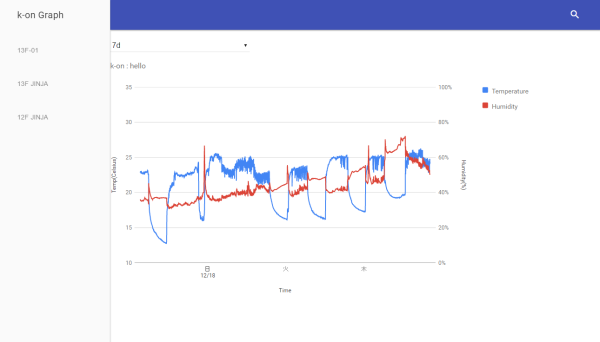

# k-on server

センサの値を記録したり，グラフ表示する為のWebサーバ．

- k-on = 計温
- 値の取得には認証かかっていません
- データストアはLevelDB(ローカルファイル)とElasticsearchが使える気がします




# Usage

```bash
go get github.com/binzume/k-on-server
cd $GOPATH/src/github.com/binzume/k-on-server
make start
open http://localhost:14201/
```

# API

json api.

## GET /status

Retrun "ok".


## POST /device

Register new device or update.


Params:

- name: device name ([a-z0-9_]{1,32})
- description: device description. (text)
- fields: (comma separeted)
- secret: device key.


```
curl -X POST http://localhost:8080/device --data "name=_default&description=test&fields=temp,humid&secret=test"
```


Update secret.

```
curl -X POST http://localhost:8080/device --data "name=_default&description=test&fields=temp,humid&secret=new&_secret=test"
```

## POST /stats/:dev_name/values

Register new value.

Params:

- _secret: device key.
- _timestamp: timestamp in millis (optional).
- device defined fields.

```
curl -X POST http://localhost:8080/stats/_default/values --data "temp=10.0&humid=40.5&_secret=test"
```


## GET /stats/:dev_name/values?from=0&limit=100

Return values.

```
curl http://localhost:8080/stats/_default/values
```


## GET /stats/:dev_name/values/latest

Return latest value.

## DELETE /stats/:dev_name/values/:timestamp

Delete value.


# License

T.B.D.


